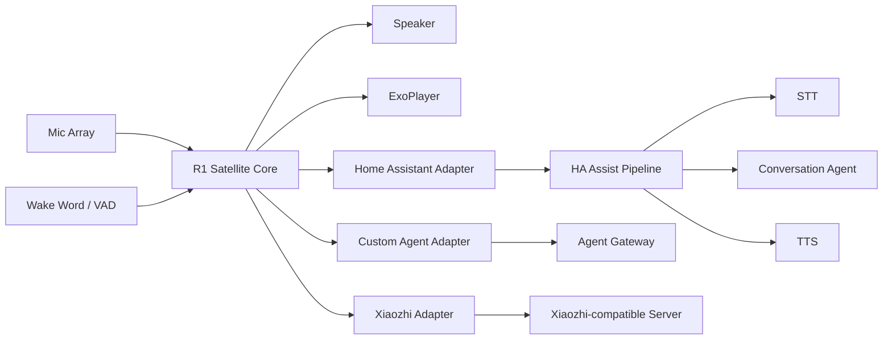

# Voice Satellite

将斐讯 R1 改造成无需拆机、优先无需 Root 的通用语音与媒体终端，并首先支持 Home Assistant Assist，同时保留 Custom Agent 与 Xiaozhi-compatible 后端扩展能力。

> 当前阶段：Architecture / MVP design。先验证设备能力和协议链路，再扩展功能，避免在一台 Android 5.1 音箱上提前建造宇宙飞船。

## Goals

- 不拆机：优先通过 Wi-Fi ADB 安装与调试。
- 不刷 ROM：尽可能保留原厂 Android Audio HAL、功放、麦克风与按键能力。
- Satellite-first：R1 负责唤醒、收音、播放、媒体与状态反馈，推理在服务器完成。
- Home Assistant first-class：接入 Assist Pipeline，并逐步暴露 Assist Satellite / Media Player 能力。
- Backend agnostic：核心层不绑定 HA、小智或单一 Agent。
- Media native：音乐和有声书直接由设备播放器消费 URL，不经过 TTS 音频链路。

## Target architecture



## Repository layout

```text
android-r1/             Android 5.1 R1 client
  core/                 Audio, wake word, VAD, state machine
  media/                ExoPlayer, queue, audiobook playback
  hardware/             Buttons, volume, optional LED
  protocol/             Backend adapters
gateway/                 Optional generic Voice Gateway
adapters/                Server-side integrations
docs/                    Architecture and protocol design
```

## MVP v0.1

1. Confirm Wi-Fi ADB installation on stock R1.
2. Record stable 16 kHz mono audio from the microphone path.
3. Implement local wake word + VAD session control.
4. Connect to Home Assistant voice pipeline through an adapter/gateway implementation validated against current HA APIs.
5. Play streaming TTS response on R1.
6. Support volume and basic playback interruption.
7. Accept media URL commands and play them with ExoPlayer.
8. Implement audio ducking when voice interaction starts during media playback.
9. Collect diagnostics: audio route, latency, memory, reconnects and session state.

## Non-goals for v0.1

- Root-only LED effects
- Full-duplex acoustic echo cancellation
- Barge-in while TTS is speaking
- Multi-room synchronized audio
- Voice identification
- Replacing Home Assistant's STT/TTS stack

## Design principles

See [`docs/01-architecture.md`](docs/01-architecture.md), [`docs/02-r1-device.md`](docs/02-r1-device.md), [`docs/03-home-assistant.md`](docs/03-home-assistant.md), [`docs/04-protocol.md`](docs/04-protocol.md), and [`docs/05-mvp-roadmap.md`](docs/05-mvp-roadmap.md).

## Prior art to evaluate

- `kitakeyos-dev/r1-manager`: R1 Android audio/VAD/Opus/media implementation reference.
- `chiduciot/phicomm_r1-xiaozhi`: R1 to Xiaozhi-compatible voice-client reference.
- `sagan/r1-helper`: stock R1 service/package behavior reference.
- Home Assistant Voice / Assist Satellite APIs: target HA integration semantics.

No code is copied from prior projects at this stage. License compatibility and exact reusable modules must be reviewed before implementation.

## Success criteria

The first meaningful milestone is deliberately boring: on an unmodified R1, say a wake word, speak a request, have Home Assistant process it, hear the response from the R1, then ask it to play a media URL. Repeat this reliably after reboot and network reconnect. If that works, the antique has officially earned another career.
