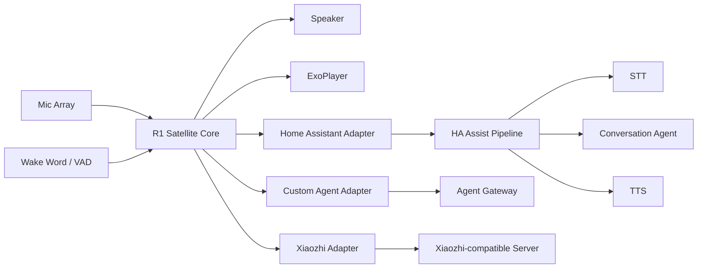

# Voice Satellite

将斐讯 R1 改造成无需拆机、优先无需 Root 的通用语音与媒体终端，并首先支持 Home Assistant Assist，同时保留 Custom Agent 与 Xiaozhi-compatible 后端扩展能力。

> 当前阶段：Architecture / MVP design。先验证设备能力和协议链路，再扩展功能，避免在一台 Android 5.1 音箱上提前建造宇宙飞船。

## Goals

- 不拆机：优先通过 Wi-Fi ADB 安装与调试。
- 不刷 ROM：尽可能保留原厂 Android Audio HAL、功放、麦克风与按键能力。
- Satellite-first：R1 负责唤醒、收音、播放、媒体与状态反馈，推理在服务器完成。
- Home Assistant first-class：接入 Assist Pipeline，并逐步暴露 Assist Satellite / Media Player 能力。
- Backend agnostic：核心层不绑定 HA、小智或单一 Agent。
- Media native：音乐和有声书直接由设备播放器消费 URL，不经过 TTS 音频链路。
- Audited reuse：优先复用已有 R1 工程中验证过的音频与媒体实现，但通过项目自有接口隔离来源代码、协议和许可证边界。

## Target architecture



## Repository layout

```text
android-r1/                 Android 5.1 R1 client
  core/
    api/                    Project-owned Audio/VAD/Wake/Codec/Media contracts
    audio/                  Conversational capture/playback implementations
    wakeword/               Replaceable wake word engines
    vad/                    VAD implementations
    session/                Satellite state machine
  media/                    ExoPlayer, queue, audiobook playback
  protocol/
    homeassistant/          HA adapter
    custom/                 Generic Agent adapter
    xiaozhi/                Clean Xiaozhi-compatible adapter
  vendor/r1/                Clean-room R1 package/hardware probes
  upstream/r1-manager/      Audited MIT-derived implementation area
gateway/                     Optional generic Voice Gateway
adapters/                    Server-side integrations
docs/                        Architecture, protocol and reuse design
THIRD_PARTY_NOTICES.md       License/provenance policy
```

## Upstream reuse strategy

The project now has an explicit reuse policy instead of treating all community code as interchangeable:

- `kitakeyos-dev/r1-manager` is MIT and is the primary implementation donor for selected audio capture, libfvad VAD, Opus and ExoPlayer pieces. Imported/adapted code must retain provenance and remain behind `android-r1/core/api` interfaces.
- `sagan/r1-helper` is GPL-2.0 and is used as a clean-room behavioral reference for stock R1 packages, boot behavior, API 22/ARMv7 compatibility and optional LED facts. Its source is not copied into the current Core.
- `chiduciot/phicomm_r1-xiaozhi` is used as a behavioral/protocol reference for Android 5.1 lifecycle and Xiaozhi activation/WebSocket flows. Its README claims MIT, while GitHub currently reports no recognized repository license file, so no source is copied until provenance is clarified.
- Snowboy/native/model assets are audited separately from the repository that happens to contain them.

See [`docs/06-source-reuse-inventory.md`](docs/06-source-reuse-inventory.md), [`docs/07-upstream-integration.md`](docs/07-upstream-integration.md), and [`THIRD_PARTY_NOTICES.md`](THIRD_PARTY_NOTICES.md).

## MVP v0.1

1. Confirm Wi-Fi ADB installation on stock R1.
2. Record stable 16 kHz mono audio from the microphone path.
3. Integrate the audited R1 audio capture/VAD path behind project Core interfaces.
4. Implement a replaceable local wake-word engine and session control.
5. Connect to Home Assistant voice pipeline through an adapter/gateway implementation validated against current HA APIs.
6. Play streaming TTS response on R1.
7. Accept media URL commands and play them with the audited ExoPlayer subset.
8. Implement audio ducking when voice interaction starts during media playback.
9. Detect stock-service conflicts without making irreversible device changes.
10. Collect diagnostics: audio route, latency, memory, reconnects and session state.

## Non-goals for v0.1

- Root-only LED effects
- Full-duplex acoustic echo cancellation
- Barge-in while TTS is speaking
- Multi-room synchronized audio
- Voice identification
- Replacing Home Assistant's STT/TTS stack
- Device-side MCP/tool runtime
- Vendor music-provider integrations

## Design documents

- [`docs/01-architecture.md`](docs/01-architecture.md)
- [`docs/02-r1-device.md`](docs/02-r1-device.md)
- [`docs/03-home-assistant.md`](docs/03-home-assistant.md)
- [`docs/04-protocol.md`](docs/04-protocol.md)
- [`docs/05-mvp-roadmap.md`](docs/05-mvp-roadmap.md)
- [`docs/06-source-reuse-inventory.md`](docs/06-source-reuse-inventory.md)
- [`docs/07-upstream-integration.md`](docs/07-upstream-integration.md)

## Success criteria

The first meaningful milestone is deliberately boring: on an unmodified R1, say a wake word, speak a request, have Home Assistant process it, hear the response from the R1, then ask it to play a media URL. Repeat this reliably after reboot and network reconnect. If that works, the antique has officially earned another career.
