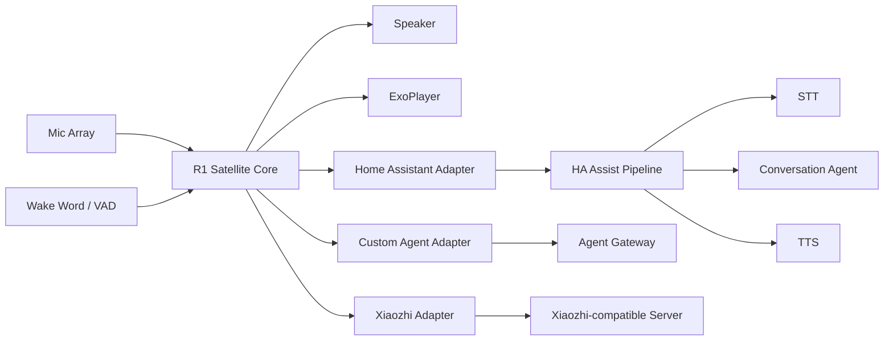

# Voice Satellite

将斐讯 R1 改造成无需拆机、优先无需 Root 的通用语音与媒体终端。当前设计主线为原厂语音前端桥接服务器 Agent；独立客户端、Home Assistant 与 Xiaozhi-compatible 路线保留为后续扩展。

> 已实现基线：Phase 2 真机 echo 已通（button 触发），HA 仍未开始。原厂桥接已新增 P1 服务器切片（受限 passthrough/fixed_reply 与离线回归），但尚未接入 R1、DNS 或真实 Agent，打断能力也未真机验收。此前的 Snowboy、sherpa-onnx KWS 与原厂前端提取实验已整合为历史/回归材料，不再决定主线。

## 当前设计：原厂语音前端桥接 Agent

保留原厂“小讯小讯”唤醒、采集、ASR 与播报链路，通过局域网兼容网关接入现有服务器 Agent。允许使用明确且已验证的外部上游，不要求全部自建。

唤醒词打断是核心验收项：等待、TTS 和音乐中能开始新轮次，旧声音停止，旧答案不回流。免唤醒词直接插话、主动播报与自动媒体恢复分别验证，未通过不标记为已支持。

停止继续投入 sherpa-onnx；现有 Android、音频编解码、WebSocket 和 echo 实现保留为回归与备用。原厂模式与独立录音/播放模式互斥，不同时启动两套音频链路。只有纯代理出现明确控制缺口时，才研究薄设备端控制层。

- [完整设计：原厂语音前端桥接方案](docs/08-stock-agent-bridge.md)
- [接口样例、20 项验收矩阵、来源与校验记录](docs/stock-agent-bridge/README.md)
- [P1 Stock Gateway 服务器切片](services/stock-gateway/README.md)

从仓库根目录校验设计资料：

```bash
python3 docs/stock-agent-bridge/validate_design.py
python3 docs/stock-agent-bridge/test_validate_design.py -v
```

这些命令仅验证文档、JSON、样例关联和引用一致性，不运行设备、网络或业务测试。

## 独立客户端路线目标（历史基线）

以下保留原路线供对照与回归；后续实施优先级以第 08 号设计文档为准。

- 不拆机：优先通过 Wi-Fi ADB 安装与调试。
- 不刷 ROM：尽可能保留原厂 Android Audio HAL、功放、麦克风与按键能力。
- Satellite-first：R1 负责唤醒、收音、播放、媒体与状态反馈，推理在服务器完成。
- Home Assistant first-class：接入 Assist Pipeline，并逐步暴露 Assist Satellite / Media Player 能力。
- Backend agnostic：核心层不绑定 HA、小智或单一 Agent。
- Media native：音乐和有声书直接由设备播放器消费 URL，不经过 TTS 音频链路。
- Audited reuse：优先复用已有 R1 工程中验证过的音频与媒体实现，但通过项目自有接口隔离来源代码、协议和许可证边界。

## 独立客户端架构（历史基线）



## Repository layout

```text
android-r1/                 Android 5.1 R1 client
  core/
    api/                    Project-owned Audio/VAD/Wake/Codec/Media contracts
    audio/                  Conversational capture/playback implementations
    wakeword/               Replaceable wake word engines
    vad/                    VAD implementations
    session/                Satellite state machine
  media/                    ExoPlayer, queue, audiobook playback
  protocol/
    homeassistant/          HA adapter
    custom/                 Generic Agent adapter
    xiaozhi/                Clean Xiaozhi-compatible adapter
  vendor/r1/                Clean-room R1 package/hardware probes
  upstream/r1-manager/      Audited MIT-derived implementation area
gateway/                     Optional generic Voice Gateway
services/stock-gateway/      Stock bridge P1 passthrough/fixed-reply service
adapters/                    Server-side integrations
docs/                        Architecture, protocol and reuse design
tools/r1-upgrade-3448/       Verified stock 3415 → 3448 upgrade package
tools/kws-probe/              Historical sherpa-onnx performance probe assets
tools/stock-frontend/         Read-only stock package/device inventory tool
THIRD_PARTY_NOTICES.md       License/provenance policy
```

## Upstream reuse strategy

The project now has an explicit reuse policy instead of treating all community code as interchangeable:

- `kitakeyos-dev/r1-manager` is MIT and is the primary implementation donor for selected audio capture, libfvad VAD, Opus and ExoPlayer pieces. Imported/adapted code must retain provenance and remain behind `android-r1/core/api` interfaces.
- `sagan/r1-helper` is GPL-2.0 and is used as a clean-room behavioral reference for stock R1 packages, boot behavior, API 22/ARMv7 compatibility and optional LED facts. Its source is not copied into the current Core.
- `chiduciot/phicomm_r1-xiaozhi` is used as a behavioral/protocol reference for Android 5.1 lifecycle and Xiaozhi activation/WebSocket flows. Its README claims MIT, while GitHub currently reports no recognized repository license file, so no source is copied until provenance is clarified.
- Snowboy/native/model assets are audited separately from the repository that happens to contain them.

See [`docs/06-source-reuse-inventory.md`](docs/06-source-reuse-inventory.md), [`docs/07-upstream-integration.md`](docs/07-upstream-integration.md), and [`THIRD_PARTY_NOTICES.md`](THIRD_PARTY_NOTICES.md).

## R1 stock firmware maintenance

The tested 3415 → 3448 backup and upgrade workflow is packaged under
[`tools/r1-upgrade-3448/`](tools/r1-upgrade-3448/README.md). It verifies the
exact source build, creates the file-level backup available through stock ADB,
hosts the bundled signed OTA on the LAN, waits for the R1 to return, and checks
the final 3448 fingerprint. The backup is not a raw brick-recovery image.

## 独立客户端 MVP v0.1（历史基线）

1. Confirm Wi-Fi ADB installation on stock R1.
2. Record stable 16 kHz mono audio from the microphone path.
3. Integrate the audited R1 audio capture/VAD path behind project Core interfaces.
4. Implement a replaceable local wake-word engine and session control.
5. Connect to Home Assistant voice pipeline through an adapter/gateway implementation validated against current HA APIs.
6. Play streaming TTS response on R1.
7. Accept media URL commands and play them with the audited ExoPlayer subset.
8. Implement audio ducking when voice interaction starts during media playback.
9. Detect stock-service conflicts without making irreversible device changes.
10. Collect diagnostics: audio route, latency, memory, reconnects and session state.

## 独立客户端 v0.1 非目标（历史基线）

此列表仅描述旧版独立客户端范围；其中播报中打断已纳入新桥接方案的核心验收，但尚未实现。

- Root-only LED effects
- Full-duplex acoustic echo cancellation
- Barge-in while TTS is speaking
- Multi-room synchronized audio
- Voice identification
- Replacing Home Assistant's STT/TTS stack
- Device-side MCP/tool runtime
- Vendor music-provider integrations

## Design documents

- [`docs/01-architecture.md`](docs/01-architecture.md)
- [`docs/02-r1-device.md`](docs/02-r1-device.md)
- [`docs/03-home-assistant.md`](docs/03-home-assistant.md)
- [`docs/04-protocol.md`](docs/04-protocol.md)
- [`docs/05-mvp-roadmap.md`](docs/05-mvp-roadmap.md)
- [`docs/06-source-reuse-inventory.md`](docs/06-source-reuse-inventory.md)
- [`docs/07-upstream-integration.md`](docs/07-upstream-integration.md)
- [`docs/08-stock-agent-bridge.md`](docs/08-stock-agent-bridge.md)
- [`docs/09-wake-word.md`](docs/09-wake-word.md) — 独立客户端唤醒实验（历史/备用）
- [`docs/10-kws-perf-probe.md`](docs/10-kws-perf-probe.md) — sherpa-onnx 真机性能结论（历史证据）
- [`docs/11-stock-frontend.md`](docs/11-stock-frontend.md) — 原厂 PCM 前端提取备选路线（已被第 08 号方案取代）
- [`docs/stock-agent-bridge/README.md`](docs/stock-agent-bridge/README.md)

## 独立客户端验收（历史基线）

The first meaningful milestone is deliberately boring: on an unmodified R1, say a wake word, speak a request, have Home Assistant process it, hear the response from the R1, then ask it to play a media URL. Repeat this reliably after reboot and network reconnect. If that works, the antique has officially earned another career.
