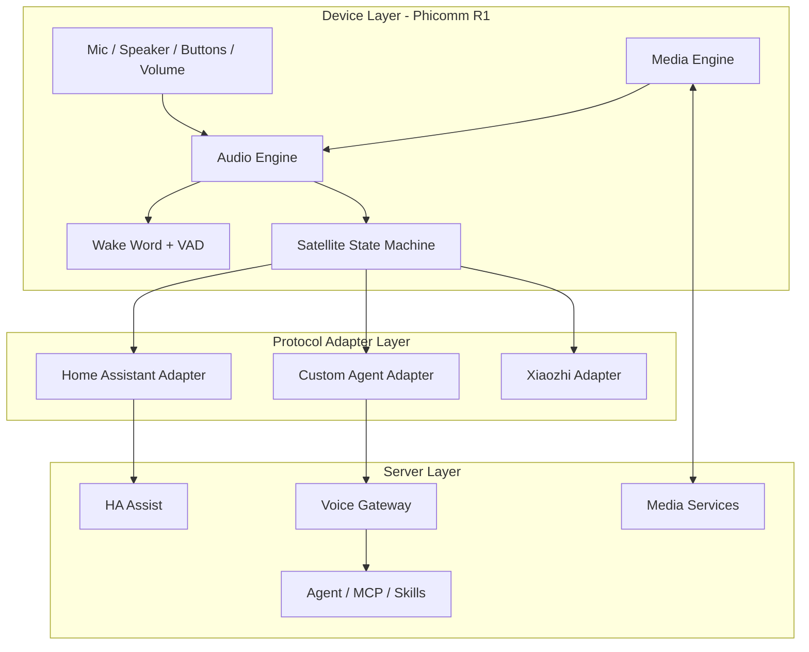
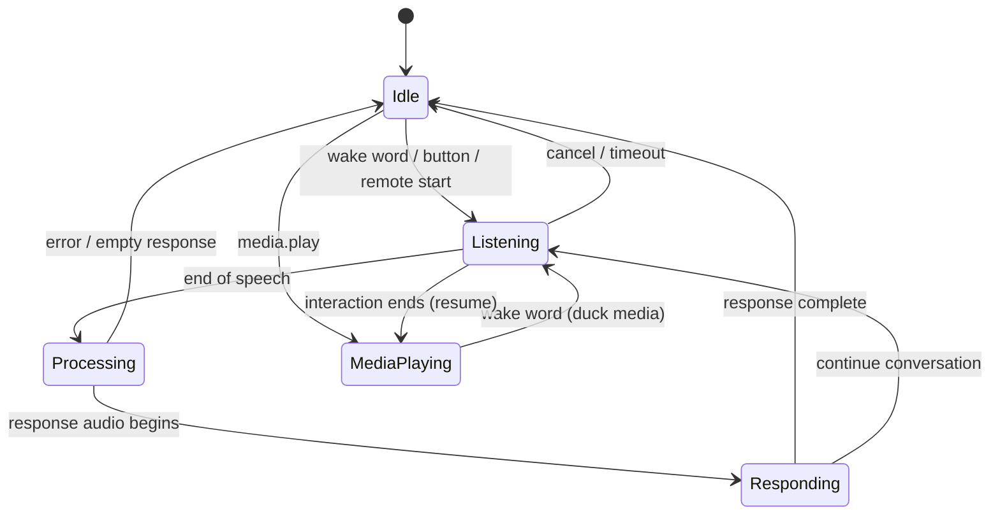

# 01. System Architecture

## 1. Problem

Phicomm R1 has useful physical hardware but obsolete cloud software. The project treats it as an edge audio appliance instead of attempting to run modern inference locally.

The device should have four responsibilities:

1. Detect when interaction should begin.
2. Capture and transport user audio.
3. Render voice responses and announcements.
4. Play long-form media efficiently.

Everything involving STT, conversation reasoning, tools, memory, smart-home state and TTS generation belongs on the server side.

## 2. Layer model

The device core must not import Home Assistant-specific concepts. Adapters translate generic events and commands to a backend protocol.

## 3. Device state machine

Internally, media playback is orthogonal to the voice-session state. A voice session may temporarily duck or pause media and restore it afterward.

## 4. Audio paths

### Voice uplink

`microphone -> AudioRecord -> optional preprocessing -> VAD -> framing -> transport`

Initial target: mono PCM 16 kHz, 16-bit. Opus may be used when the selected backend/gateway benefits from compression. Do not commit the HA adapter to Opus until the current HA endpoint semantics are validated in implementation.

### Voice downlink

`backend stream -> decoder -> AudioTrack -> speaker`

Low first-audio latency matters more than maximum fidelity for conversational TTS.

### Media

`HTTP(S)/HLS media URL -> ExoPlayer -> speaker`

Long-form media must not be tunneled through the conversational audio transport.

## 5. Deployment modes

### Direct HA mode

R1 connects directly to a supported Home Assistant endpoint if the required satellite behavior can be implemented cleanly on Android 5.1.

### Gateway mode

R1 connects to Voice Gateway over a small, versioned protocol. Gateway translates device sessions to Home Assistant or another agent backend.

Gateway mode is the fallback and likely the most portable long-term architecture because Android 5.1 has old TLS/runtime constraints and Home Assistant APIs evolve independently of the R1 client.

## 6. Failure model

The client must survive:

- Wi-Fi loss and DHCP address changes
- server restart
- backend authentication expiration
- microphone initialization failure
- audio focus loss
- media URL failure
- malformed protocol messages
- process recreation / reboot

Recovery should return the device to `Idle` without requiring ADB intervention.

## 7. Security baseline

- Never embed permanent HA administrator credentials in source or APK.
- Prefer per-device revocable credentials.
- Gateway authentication must support credential rotation.
- Log metadata and state transitions, not raw microphone audio by default.
- Remote microphone activation must be visible in device state and constrained by explicit configuration.

## 8. Architectural decision for v0.1

Build the R1 core as backend-neutral, but implement Home Assistant first. Keep a gateway boundary available even if the earliest proof of concept can connect directly. This avoids welding a 2010s Android runtime to one fast-moving server API and then acting surprised when time continues to pass.
