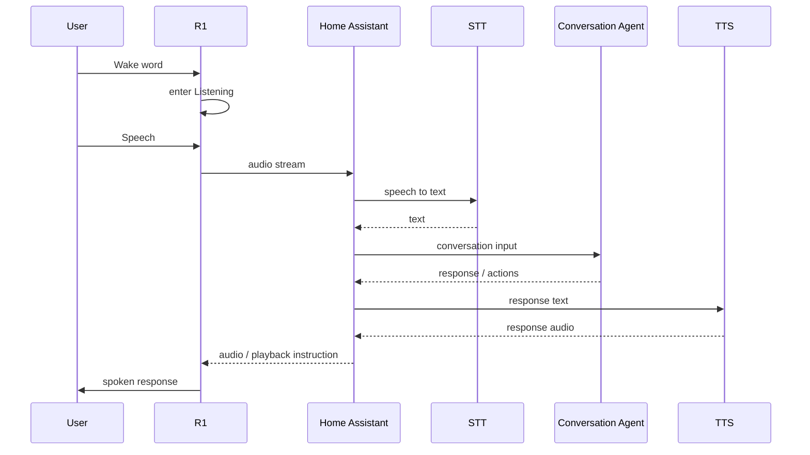

# 03. Home Assistant Integration

## Objective

Make R1 behave as a Home Assistant voice endpoint while keeping the Android core independent from Home Assistant implementation details.

## Desired user-visible behavior

A configured R1 should eventually appear in Home Assistant as one logical device with capabilities such as:

```text
Phicomm R1 - Living Room
  Assist Satellite
  Media Player
  Volume
  Diagnostics
  optional LED/status controls
```

The exact entity/integration implementation depends on which current Home Assistant API path proves maintainable during the spike.

## Assist interaction



## Integration strategies to spike

### Strategy A: native/direct satellite protocol

Implement the current HA-supported satellite transport semantics in Android.

Pros:
- fewer moving parts
- low latency

Risks:
- Android 5.1 compatibility
- protocol evolution
- authentication/TLS constraints

### Strategy B: Voice Gateway bridge

R1 speaks the project protocol to a small service running beside HA. Gateway implements the current HA-facing integration.

Pros:
- isolates legacy Android from HA API churn
- easier protocol tracing and testing
- supports custom Agent and Xiaozhi adapters naturally

Risks:
- another service to deploy

### Decision rule

Do a short implementation spike for direct mode. If it requires fragile compatibility hacks or prevents first-class HA features, use Gateway mode for v0.1 rather than turning architectural purity into a hobby.

## HA responsibilities

Home Assistant should own:

- Assist Pipeline orchestration
- STT provider selection
- Conversation Agent selection
- smart-home intents/actions
- TTS provider selection
- automation-triggered announcements

R1 should not contain entity-control logic.

## Custom Agent

The preferred architecture permits HA's conversation stage to delegate to a custom agent. That agent may expose tools, memory, MCP or other capabilities while Home Assistant remains the home-control and voice-pipeline environment.

## Announcements

A later milestone should support HA-initiated announcements:

```text
HA automation -> satellite announcement -> duck/pause media -> play announcement -> restore media
```

## Continuous conversation

Later versions may accept a backend command to return directly to `Listening` after a response. This must be explicit and time-bounded so the microphone does not remain in an unintended conversational state.

## Media Player integration

Voice responses and long-form media are separate concerns. HA or the Agent may instruct the R1 MediaEngine to play a URL. The device reports playback state and progress where practical.

## Validation checklist

- HA discovers/configures the endpoint predictably.
- Wake-to-listening transition is visible and reliable.
- Audio reaches the configured Assist Pipeline.
- HA actions execute from spoken commands.
- TTS starts quickly enough for natural interaction.
- Server restart does not require re-pairing.
- Announcement does not permanently disrupt current media.
