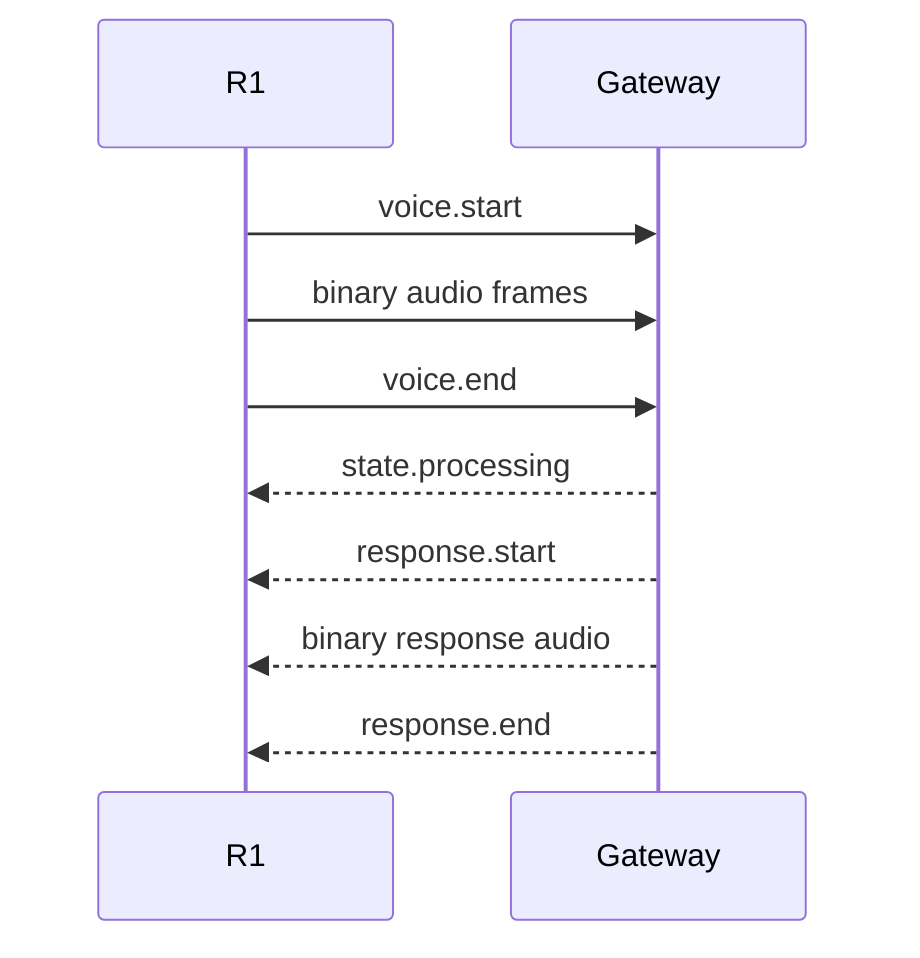

# 04. Voice Satellite Protocol Draft

Status: design draft, not stable API.

The protocol exists so legacy clients can remain simple while adapters evolve independently.

## Transport

Initial candidate: WebSocket.

Control messages are JSON. Audio frames should use binary WebSocket frames to avoid base64 overhead.

## Handshake

Client -> server:

```json
{
  "type": "hello",
  "protocol": 1,
  "device_id": "r1-living-room",
  "device": {
    "model": "phicomm-r1",
    "client_version": "0.1.0",
    "platform": "android-5.1"
  },
  "capabilities": [
    "audio.pcm16",
    "wake.local",
    "media.url",
    "media.duck"
  ]
}
```

Server -> client:

```json
{
  "type": "hello.ack",
  "protocol": 1,
  "session_id": "connection-session-id",
  "heartbeat_seconds": 30
}
```

## Voice session



Example start:

```json
{
  "type": "voice.start",
  "session_id": "uuid",
  "trigger": "wake_word",
  "audio": {
    "codec": "pcm_s16le",
    "sample_rate": 16000,
    "channels": 1
  }
}
```

End:

```json
{
  "type": "voice.end",
  "session_id": "uuid",
  "reason": "vad_end"
}
```

## State messages

```json
{"type":"state","state":"idle"}
{"type":"state","state":"listening"}
{"type":"state","state":"processing"}
{"type":"state","state":"responding"}
```

## Media commands

Server -> client:

```json
{
  "type": "media.play",
  "request_id": "uuid",
  "media": {
    "url": "https://example/media/track.m3u8",
    "kind": "music",
    "title": "Example Track",
    "position_ms": 0
  }
}
```

Other commands:

```text
media.pause
media.resume
media.stop
media.seek
media.set_volume
```

Client reports:

```json
{
  "type": "media.state",
  "state": "playing",
  "position_ms": 42812,
  "duration_ms": 220000
}
```

## Announcement command

```json
{
  "type": "announce",
  "request_id": "uuid",
  "url": "https://server/tts/announcement.wav",
  "behavior": "duck_and_resume"
}
```

## Errors

```json
{
  "type": "error",
  "code": "AUDIO_CAPTURE_FAILED",
  "message": "AudioRecord initialization failed",
  "recoverable": true
}
```

## Heartbeat

Added while implementing `transport/ConnectionSupervisor`; still draft.

The client paces heartbeats with `heartbeat_seconds` from `hello.ack`. When no
inbound frame (JSON or binary) has arrived for one interval, the client sends:

```json
{"type":"ping","session_id":"connection-session-id"}
```

Any inbound frame — not only an explicit `pong` — proves liveness and resets
the interval. The server may answer with `{"type":"pong"}`. If no inbound frame
arrives within the client-side heartbeat timeout after a `ping`, the client
declares the connection dead and reconnects.

## Client implementation notes (draft)

Pinned while implementing `protocol/Protocol` and `session/SessionController`
in the 0.2.0-dev client; the protocol remains a draft:

- `voice.start` `trigger` values: `wake_word`, `button`.
- `voice.end` `reason` values: `vad_end`, `timeout`, `cancelled`, `error`.
- The client uplink format in `voice.start.audio` is fixed to
  `pcm_s16le` / 16000 Hz / 1 channel until the PCM-vs-Opus question is settled.
- `hello.ack` fields `protocol`, `session_id` and `heartbeat_seconds` are all
  required; a missing or non-positive field rejects the handshake.
- `error` fields `code` and `recoverable` are required; `message` may be empty.
- Malformed JSON frames and frames without a string `type` are dropped.
- Well-formed frames with an unknown `type` are parsed and ignored; they must
  not crash the client (see Versioning).
- The server `state` value `responding` maps to the client session state
  `SPEAKING`; `idle` from the server forces the client session back to `IDLE`.
- A new wake word while `PROCESSING` or `SPEAKING` is rejected by the client
  session controller (barge-in is a v0.1 non-goal).

## Versioning

- Integer protocol major version in handshake.
- New optional message fields are backward compatible.
- Capability negotiation gates optional behavior.
- Unknown message types must not crash the client.

## Authentication

The protocol must support per-device credentials and rotation. Exact scheme is deferred until deployment mode is selected. Permanent secrets must not be committed to the repository.

## Open questions

- PCM vs Opus as default uplink after R1 profiling.
- Whether response audio should be binary streamed or represented as a URL for some backends.
- Direct HA mode vs Gateway mode for v0.1.
- Discovery/pairing mechanism on a trusted LAN.
