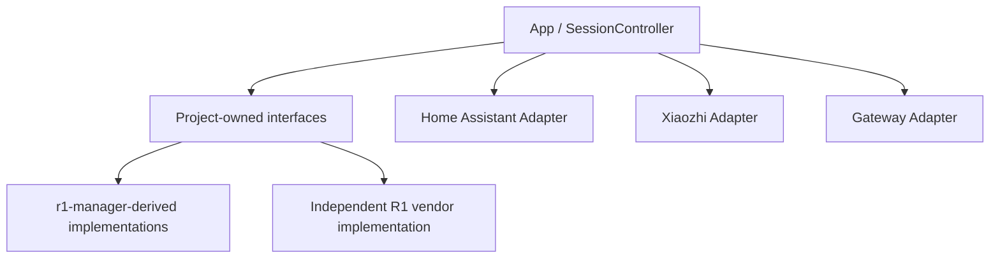
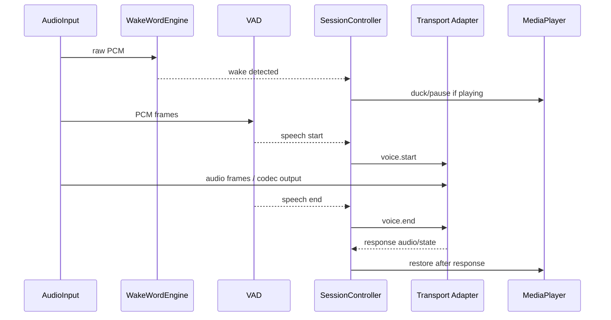

# 07. Upstream Integration Architecture

This document turns the reuse inventory into project structure. Upstream-derived code never talks directly to Home Assistant, Xiaozhi or the Agent. It implements small project-owned interfaces.

## Dependency direction



The arrows mean runtime dependency/use, not source ownership. Protocol adapters consume Core events. Core must not import protocol-specific classes.

## Project-owned contracts

### AudioInput

```text
start(AudioFrameListener)
stop()
isRunning()
getFormat()
```

Candidate first implementation: adapt the useful parts of `r1-manager` `AudioRecorder`.

The implementation must expose raw PCM continuously. Endpointing is not embedded permanently in the recorder contract, because wake-word detection, VAD and debugging may all need the same stream.

### VoiceActivityDetector

```text
initialize(config)
isSpeech(pcmFrame)
reset()
release()
```

Candidate first implementation: libfvad wrapper adapted from `r1-manager` `VadDetector`, with an amplitude fallback strategy owned by our VAD/session layer.

### AudioCodec

```text
encode(pcmFrame)
decode(encodedFrame)
release()
```

Candidate implementation: Opus encoder/decoder adapted from `r1-manager`. PCM remains a valid transport capability so Core never requires Opus.

### WakeWordEngine

```text
initialize(model/config)
process(pcmFrame)
reset()
release()
```

No implementation is selected yet. The `r1-manager` Snowboy wrapper is a useful API/compatibility reference, but its native/model/asset provenance requires separate review.

### ConversationalAudioOutput

```text
start(format)
write(pcmFrame)
stop()
```

Purpose: low-latency TTS streaming through AudioTrack-style playback. This is separate from long-form media playback.

### MediaPlayer

```text
play(media)
pause()
resume()
stop()
seek(positionMs)
setVolume(level)
getState()
duck(level)
restore()
```

Candidate first implementation: extract the generic URL/queue/playback subset of `r1-manager` `ExoPlayerService`, removing ZingMp3, LED and project-specific song-model coupling.

### DeviceCapabilities

```text
microphone
speaker
media
wakeWord
vad
opus
buttons
led
root
vendorServiceControl
```

Capabilities are discovered at runtime. Optional hardware must never become a constructor requirement for the Satellite Core.

## Target Android tree

```text
android-r1/
  app/
    lifecycle/
    diagnostics/

  core/
    api/
      AudioInput
      AudioCodec
      VoiceActivityDetector
      WakeWordEngine
      ConversationalAudioOutput
      MediaPlayer
      DeviceCapabilities
    audio/
    vad/
    wakeword/
    session/

  media/

  transport/
    websocket/

  protocol/
    homeassistant/
    custom/
    xiaozhi/

  vendor/
    r1/
      PackageConflictProbe
      CapabilityProbe
      optional-led/

  upstream/
    r1-manager/
      README.md
      <only audited imported/adapted source>
```

## Where each upstream project lands

### r1-manager

`r1-manager` is an implementation donor, not the architecture owner.

```text
AudioRecorder --------> core/audio implementation
VadDetector ----------> core/vad implementation
OpusEncoder/Decoder --> core/audio/codec implementation
XiaozhiAudioEngine ---> session design patterns only
ExoPlayerService -----> media implementation subset
WebSocket code --------> transport patterns/subset
Snowboy wrapper -------> wakeword compatibility reference only for now
MCP -------------------> not imported into device Core
LED -------------------> optional hardware reference
```

Where practical, imported/adapted MIT code stays under `android-r1/upstream/r1-manager/` and is wrapped by Core adapters. If a small source fragment is substantially rewritten into Core instead, its provenance is still recorded in `THIRD_PARTY_NOTICES.md`.

## phicomm_r1-xiaozhi

This project informs an independent Xiaozhi adapter and API-22 lifecycle tests.

```text
VoiceRecognitionService ----> lifecycle/error test cases
XiaozhiConnectionService ---> protocol behavior specification
BootReceiver ----------------> boot/recovery requirements
AudioPlaybackService --------> playback lifecycle test cases
Config profiles -------------> backend profile requirements
```

We explicitly do not carry over trust-all TLS behavior or simple energy threshold pretending to be wake-word recognition.

## r1-helper

This project becomes R1 platform knowledge, not a source dependency.

```text
package conflict list -------> vendor/r1/PackageConflictProbe
launcher safety rule --------> tools/vendor safety guard
LED sysfs observation -------> optional capability probe
API22/ARMv7 behavior --------> platform compatibility tests
boot behavior ---------------> lifecycle tests
```

All package changes must be reversible. The default app must observe and report conflicts before changing system packages.

## SessionController integration



The important architectural change is that VAD and wake-word behavior no longer live inside a Xiaozhi-specific audio engine. They are reusable device capabilities.

## Import gates

Before any upstream implementation becomes production code it must pass:

1. License/provenance audit.
2. API 22 / armeabi-v7a build.
3. Stock R1 installation over Wi-Fi ADB.
4. Memory/CPU profiling.
5. 20-session voice reliability test.
6. Network/restart recovery test where applicable.
7. No dependency from Core back into an upstream app/service singleton.

This lets us reuse the useful engineering without inheriting every architectural decision the upstream apps accumulated while surviving on a discontinued speaker. Evolution has enough accidents already.
